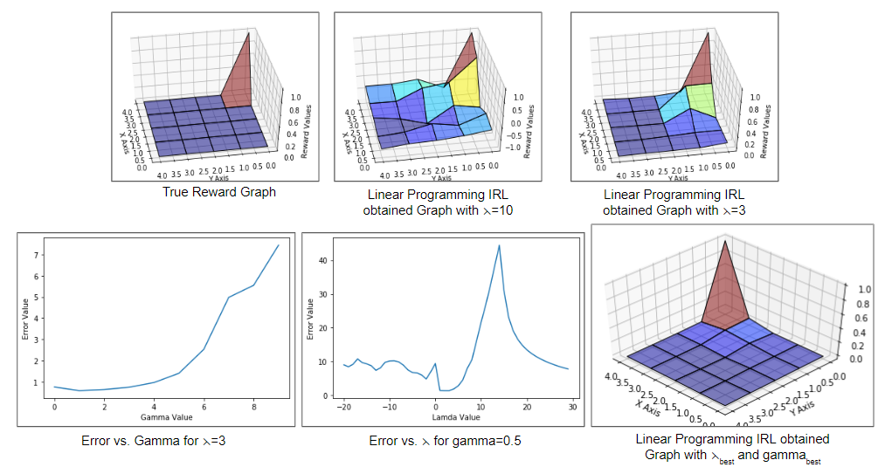
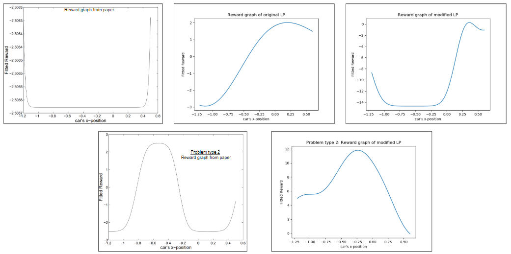
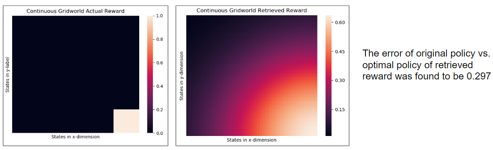

# inverse_rl
Implementing the pioneering IRL papers "Algorithms for Inverse Reinforcement Learning" - (Ng &amp;Russell 2000) 

### Goal of the Project
Implement the paper "Algorithms for Inverse Reinforcement Learning" - (Ng & Russell 2000) and replicate results for,
- Finite State Space: Gridworld
- Large State Space: Mountain Car
- Through Sampled Trajectories: Continuous Gridworld

<!-- Project Slides: https://docs.google.com/presentation/d/1AWFvX9gJo-zOEUKXb7btw6uewzU_UlEXoNEeBiDgTe8/edit#slide=id.g7a603d1201_0_45 -->
## Results
#### Linear Programming IRL - Discrete Gridworld

#### Linear Programming IRL - Mountain Car

#### Linear Programming IRL - Continuous Gridworld

